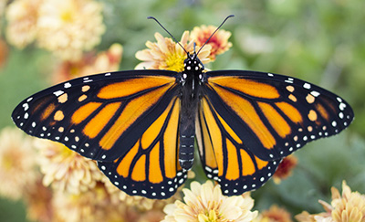

<!DOCTYPE html>
<html lang="en">
<head>
  <meta charset="UTF-8">
  <meta name="viewport" content="width=device-width, initial-scale=1.0">
  
</head>
<body>
  

    

      
    

    

      
    

    

      
    

    

      
    

    

      
      
    

    

      
    

  

</body>
</html>
